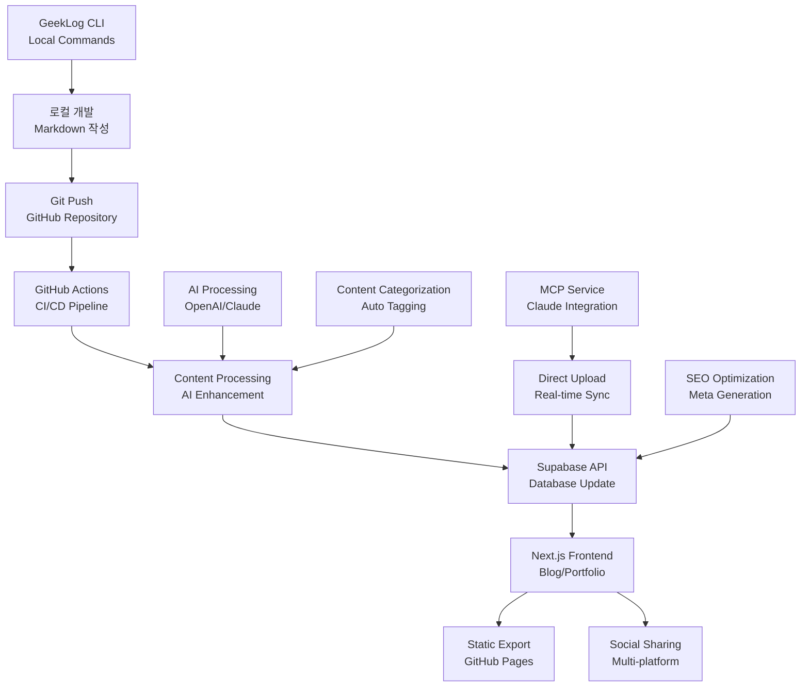

# GeekLog 시스템 설계 문서

> JavaScript/TypeScript 기반 Markdown 블로그/포트폴리오 관리 시스템
>
> 작성일: 2025년 8월 23일

## 📋 목차

1. [시스템 개요](#시스템-개요)
2. [시스템 아키텍처](#시스템-아키텍처)
3. [저장소 및 데이터베이스 설계](#저장소-및-데이터베이스-설계)
4. [API 설계](#api-설계)
5. [자동화 파이프라인](#자동화-파이프라인)
6. [혁신적 기능](#혁신적-기능)
7. [구현 로드맵](#구현-로드맵)

---

## 🎯 시스템 개요

GeekLog는 개발자를 위한 차세대 콘텐츠 관리 시스템으로, Git 기반의 Markdown 작성과 자동화된 멀티플랫폼 배포를 지원합니다.

### 핵심 가치 제안

- **Git-First**: 모든 콘텐츠를 Git으로 버전 관리
- **AI-Enhanced**: 콘텐츠 분류, SEO 최적화, 자동 태깅
- **Multi-Platform**: 블로그, 포트폴리오, 이력서를 하나의 소스로 관리
- **Developer-Friendly**: CLI, MCP 서비스, GitHub Actions 완전 지원

---

## 🏗️ 시스템 아키텍처

### 시스템 구성도



### 기술 스택

**Frontend**

- Next.js 14 (App Router)
- TypeScript
- Tailwind CSS
- React Server Components

**Backend**

- Supabase (Database + Auth + Storage)
- Node.js (GitHub Actions)
- Aws Or Home Cloud (Hosting)

**AI/ML**

- OpenAI GPT-4 (Content Enhancement)
- Claude (MCP Integration)

**DevOps**

- GitHub Actions
- Docker (컨테이너화)
- Vercel Deployment

---

## 💾 저장소 및 데이터베이스 설계

### 1️⃣ Git 저장소 구조 (Source of Truth)

```
geeklog/
├── posts/
│   ├── blog/
│   │   ├── 2025-01-ai-note-taking.md
│   │   ├── 2025-02-system-design.md
│   │   └── 2025-03-typescript-tips.md
│   ├── portfolio/
│   │   ├── project-360-viewer.md
│   │   ├── project-ev-dashboard.md
│   │   └── project-ai-chatbot.md
│   ├── resume/
│   │   ├── resume-korean.md
│   │   ├── resume-english.md
│   │   └── cv-academic.md
│   ├── career/
│   │   ├── 2024-senior-developer.md
│   │   ├── 2023-fullstack-engineer.md
│   │   └── skills-timeline.md
│   └── meta/
│       ├── tags.yml
│       ├── categories.yml
│       └── config.yml
├── packages/
│   ├── cli/          # GeekLog CLI
│   ├── web/          # Next.js Frontend
│   └── api/          # Supabase Functions
└── docs/
    ├── SYSTEM_DESIGN.md
    └── API_DOCS.md
```

### 2️⃣ Markdown Front Matter 표준

```yaml
---
# 공통 메타데이터
title: "React 성능 최적화 실전 가이드"
slug: "react-performance-optimization"
type: "blog" # blog | portfolio | resume | career
created_at: "2025-01-15"
updated_at: "2025-01-16"
published: true
featured: false

# 카테고리 및 태깅
category: "Frontend"
tags: ["React", "Performance", "TypeScript"]
difficulty: "intermediate" # beginner | intermediate | advanced
estimated_read_time: 7

# SEO 최적화
seo_title: "React 렌더링 성능 최적화 완전 가이드"
meta_description: "실제 프로덕션에서 마주친 React 성능 이슈와 해결 과정을 단계별로 정리"
og_image: "/images/react-performance-cover.jpg"
canonical_url: "https://geeklog.dev/blog/react-performance-optimization"

# 프로젝트 전용 (portfolio type)
project_url: "https://github.com/username/project"
demo_url: "https://project-demo.vercel.app"
tech_stack: ["Next.js", "TypeScript", "Tailwind"]
project_period: "2024-12 ~ 2025-01"
team_size: 3
my_role: "Frontend Lead"

# 경력 전용 (career type)
company: "TechCorp"
position: "Senior Frontend Developer"
employment_period: "2023-03 ~ 2024-12"
achievements: ["성능 개선 40%", "팀 리드 경험"]
---
```

### 3️⃣ Supabase 데이터베이스 스키마

```sql
-- 블로그 포스트
CREATE TABLE blog_posts (
  id UUID PRIMARY KEY DEFAULT gen_random_uuid(),
  title TEXT NOT NULL,
  slug TEXT UNIQUE NOT NULL,
  content TEXT NOT NULL, -- Markdown content
  type TEXT CHECK (type IN ('blog', 'portfolio', 'resume', 'career')),
  category TEXT,
  tags TEXT[] DEFAULT '{}',
  difficulty TEXT CHECK (difficulty IN ('beginner', 'intermediate', 'advanced')),
  estimated_read_time INTEGER,

  -- SEO
  seo_title TEXT,
  meta_description TEXT,
  og_image TEXT,
  canonical_url TEXT,

  -- 프로젝트 관련 (portfolio type)
  project_url TEXT,
  demo_url TEXT,
  tech_stack TEXT[] DEFAULT '{}',
  project_period TEXT,
  team_size INTEGER,
  my_role TEXT,

  -- 경력 관련 (career type)
  company TEXT,
  position TEXT,
  employment_period TEXT,
  achievements TEXT[] DEFAULT '{}',

  -- 공통
  published BOOLEAN DEFAULT false,
  featured BOOLEAN DEFAULT false,
  view_count INTEGER DEFAULT 0,
  like_count INTEGER DEFAULT 0,
  created_at TIMESTAMP WITH TIME ZONE DEFAULT NOW(),
  updated_at TIMESTAMP WITH TIME ZONE DEFAULT NOW(),

  -- 검색 최적화
  search_vector tsvector GENERATED ALWAYS AS (
    to_tsvector('english', title || ' ' || COALESCE(content, ''))
  ) STORED
);

-- 태그 관리
CREATE TABLE tags (
  id UUID PRIMARY KEY DEFAULT gen_random_uuid(),
  name TEXT UNIQUE NOT NULL,
  color TEXT DEFAULT '#6B7280',
  description TEXT,
  usage_count INTEGER DEFAULT 0,
  created_at TIMESTAMP WITH TIME ZONE DEFAULT NOW()
);

-- 카테고리 관리
CREATE TABLE categories (
  id UUID PRIMARY KEY DEFAULT gen_random_uuid(),
  name TEXT UNIQUE NOT NULL,
  slug TEXT UNIQUE NOT NULL,
  description TEXT,
  icon TEXT,
  post_count INTEGER DEFAULT 0,
  created_at TIMESTAMP WITH TIME ZONE DEFAULT NOW()
);

-- 소셜 미디어 동기화 로그
CREATE TABLE sync_logs (
  id UUID PRIMARY KEY DEFAULT gen_random_uuid(),
  post_id UUID REFERENCES blog_posts(id),
  platform TEXT, -- 'linkedin', 'medium', 'dev.to', etc.
  status TEXT CHECK (status IN ('pending', 'success', 'failed')),
  external_url TEXT,
  error_message TEXT,
  synced_at TIMESTAMP WITH TIME ZONE DEFAULT NOW()
);

-- 인덱스 생성
CREATE INDEX idx_blog_posts_published ON blog_posts(published, created_at DESC);
CREATE INDEX idx_blog_posts_type ON blog_posts(type);
CREATE INDEX idx_blog_posts_tags ON blog_posts USING GIN(tags);
CREATE INDEX idx_blog_posts_search ON blog_posts USING GIN(search_vector);
```

---

## 🔌 API 설계

### Next.js API Routes

```typescript
// app/api/posts/route.ts
export async function GET(request: Request) {
  const { searchParams } = new URL(request.url);
  const type = searchParams.get("type"); // blog | portfolio | resume | career
  const category = searchParams.get("category");
  const tags = searchParams.get("tags");
  const page = parseInt(searchParams.get("page") || "1");

  // Supabase query with filters
  const { data, error } = await supabase
    .from("blog_posts")
    .select("*")
    .eq("published", true)
    .ilike("type", type || "%")
    .range((page - 1) * 10, page * 10 - 1)
    .order("created_at", { ascending: false });

  return Response.json({ posts: data, error });
}

// app/api/posts/[slug]/route.ts
export async function GET(
  request: Request,
  { params }: { params: { slug: string } }
) {
  const { data: post } = await supabase
    .from("blog_posts")
    .select("*")
    .eq("slug", params.slug)
    .eq("published", true)
    .single();

  if (!post) {
    return Response.json({ error: "Post not found" }, { status: 404 });
  }

  // 조회수 증가
  await supabase
    .from("blog_posts")
    .update({ view_count: post.view_count + 1 })
    .eq("id", post.id);

  return Response.json({ post });
}

// app/api/search/route.ts
export async function GET(request: Request) {
  const { searchParams } = new URL(request.url);
  const query = searchParams.get("q");

  if (!query) {
    return Response.json({ posts: [] });
  }

  const { data } = await supabase
    .from("blog_posts")
    .select("*")
    .textSearch("search_vector", query)
    .eq("published", true)
    .limit(20);

  return Response.json({ posts: data });
}
```

### Supabase Edge Functions

```typescript
// supabase/functions/sync-content/index.ts
import { serve } from "https://deno.land/std@0.168.0/http/server.ts";
import { createClient } from "https://esm.sh/@supabase/supabase-js@2";

serve(async (req) => {
  const { posts } = await req.json();

  const supabase = createClient(
    Deno.env.get("SUPABASE_URL")!,
    Deno.env.get("SUPABASE_SERVICE_ROLE_KEY")!
  );

  for (const post of posts) {
    // AI enhancement
    const enhancedPost = await enhanceWithAI(post);

    // Upsert to database
    await supabase.from("blog_posts").upsert(enhancedPost, {
      onConflict: "slug",
      ignoreDuplicates: false,
    });
  }

  return new Response(JSON.stringify({ success: true }));
});

async function enhanceWithAI(post: any) {
  // OpenAI API call for SEO optimization
  const seoData = await generateSEOMetadata(post.content);

  // Auto-categorization
  const category = await categorizeContent(post.content);

  // Auto-tagging
  const tags = await extractTags(post.content);

  return {
    ...post,
    ...seoData,
    category,
    tags,
    estimated_read_time: calculateReadTime(post.content),
  };
}
```

---

## ⚙️ 자동화 파이프라인

### GitHub Actions Workflow

```yaml
# .github/workflows/content-sync.yml
name: GeekLog Content Sync

on:
  push:
    branches: ["main"]
    paths: ["posts/**/*.md"]
  pull_request:
    branches: ["main"]
    paths: ["posts/**/*.md"]

jobs:
  sync-content:
    runs-on: ubuntu-latest

    steps:
      - name: Checkout Repository
        uses: actions/checkout@v4
        with:
          fetch-depth: 2 # For git diff

      - name: Setup Node.js
        uses: actions/setup-node@v4
        with:
          node-version: "18"
          cache: "npm"

      - name: Install Dependencies
        run: |
          cd packages/api
          npm ci

      - name: Parse Changed Files
        id: changes
        run: |
          # Git으로 변경된 .md 파일들만 추출
          echo "changed_files=$(git diff --name-only HEAD~1 HEAD | grep '\.md$' | jq -R -s -c 'split("\n")[:-1]')" >> $GITHUB_OUTPUT

      - name: Process Markdown Files
        run: |
          cd packages/api
          node scripts/process-markdown.js '${{ steps.changes.outputs.changed_files }}'
        env:
          SUPABASE_URL: ${{ secrets.SUPABASE_URL }}
          SUPABASE_SERVICE_ROLE_KEY: ${{ secrets.SUPABASE_SERVICE_ROLE_KEY }}
          OPENAI_API_KEY: ${{ secrets.OPENAI_API_KEY }}

      - name: Deploy to Vercel
        if: github.ref == 'refs/heads/main'
        uses: amondnet/vercel-action@v25
        with:
          vercel-token: ${{ secrets.VERCEL_TOKEN }}
          vercel-org-id: ${{ secrets.VERCEL_ORG_ID }}
          vercel-project-id: ${{ secrets.VERCEL_PROJECT_ID }}
          working-directory: packages/web
```

### Markdown 처리 스크립트

```javascript
// packages/api/scripts/process-markdown.js
const fs = require("fs").promises;
const path = require("path");
const matter = require("gray-matter");
const { createClient } = require("@supabase/supabase-js");
const OpenAI = require("openai");

const supabase = createClient(
  process.env.SUPABASE_URL,
  process.env.SUPABASE_SERVICE_ROLE_KEY
);

const openai = new OpenAI({
  apiKey: process.env.OPENAI_API_KEY,
});

async function processMarkdownFiles(changedFiles) {
  const posts = [];

  for (const filePath of changedFiles) {
    if (!filePath.endsWith(".md") || !filePath.startsWith("posts/")) {
      continue;
    }

    const content = await fs.readFile(filePath, "utf-8");
    const { data: frontmatter, content: markdownContent } = matter(content);

    // 파일 경로에서 type 추출
    const type = filePath.split("/")[1]; // posts/blog/... -> blog

    // Slug 생성
    const fileName = path.basename(filePath, ".md");
    const slug = frontmatter.slug || fileName;

    const post = {
      ...frontmatter,
      content: markdownContent,
      type,
      slug,
      file_path: filePath,
    };

    // AI Enhancement
    const enhancedPost = await enhanceWithAI(post);
    posts.push(enhancedPost);
  }

  // Supabase에 일괄 업데이트
  for (const post of posts) {
    const { error } = await supabase
      .from("blog_posts")
      .upsert(post, { onConflict: "slug" });

    if (error) {
      console.error(`Error updating post ${post.slug}:`, error);
    } else {
      console.log(`✅ Updated post: ${post.slug}`);
    }
  }
}

async function enhanceWithAI(post) {
  try {
    // SEO 메타데이터 생성
    const seoPrompt = `
    다음 블로그 포스트의 SEO를 최적화해주세요:
    
    제목: ${post.title}
    내용: ${post.content.substring(0, 1000)}...
    
    다음 JSON 형식으로 응답해주세요:
    {
      "seo_title": "검색 최적화된 제목 (60자 이내)",
      "meta_description": "메타 설명 (160자 이내)",
      "suggested_tags": ["태그1", "태그2", "태그3"],
      "category": "적절한 카테고리",
      "estimated_read_time": 예상독서시간(분)
    }
    `;

    const completion = await openai.chat.completions.create({
      model: "gpt-4",
      messages: [{ role: "user", content: seoPrompt }],
      temperature: 0.3,
    });

    const aiResponse = JSON.parse(completion.choices[0].message.content);

    return {
      ...post,
      seo_title: aiResponse.seo_title,
      meta_description: aiResponse.meta_description,
      tags: [...(post.tags || []), ...aiResponse.suggested_tags],
      category: post.category || aiResponse.category,
      estimated_read_time: aiResponse.estimated_read_time,
      updated_at: new Date().toISOString(),
    };
  } catch (error) {
    console.error("AI Enhancement failed:", error);
    return post; // Return original post if AI fails
  }
}

// CLI에서 호출
const changedFiles = JSON.parse(process.argv[2] || "[]");
processMarkdownFiles(changedFiles);
```

---

## 💡 혁신적 기능

### 1. 스마트 콘텐츠 분류 시스템

```typescript
// packages/api/lib/ai-classifier.ts
export class SmartContentClassifier {
  async analyzeContent(content: string) {
    const prompt = `
    다음 마크다운 콘텐츠를 분석하여 분류해주세요:
    
    ${content.substring(0, 2000)}
    
    JSON 형식으로 응답:
    {
      "content_type": "blog|portfolio|resume|career",
      "difficulty_level": "beginner|intermediate|advanced",
      "tech_stack": ["기술1", "기술2"],
      "target_audience": "developer|recruiter|general",
      "main_topic": "주요 주제",
      "subtopics": ["부주제1", "부주제2"],
      "industry": "산업 분야"
    }
    `;

    // OpenAI API 호출
    const analysis = await this.callOpenAI(prompt);
    return analysis;
  }

  async generateAutoRouting(analysis: any) {
    const routes = {
      blog: `/blog/${analysis.main_topic.toLowerCase()}`,
      portfolio: `/projects/${analysis.main_topic.toLowerCase()}`,
      resume: `/about/${analysis.subtopics[0]?.toLowerCase()}`,
      career: `/experience/${analysis.industry.toLowerCase()}`,
    };

    return routes[analysis.content_type];
  }
}
```

### 2. 멀티플랫폼 동기화 엔진

```typescript
// packages/api/lib/multi-platform-sync.ts
export class MultiPlatformSyncEngine {
  private adapters = {
    linkedin: new LinkedInAdapter(),
    medium: new MediumAdapter(),
    devto: new DevToAdapter(),
    hashnode: new HashnodeAdapter(),
  };

  async syncContent(post: BlogPost, platforms: string[]) {
    const results = [];

    for (const platform of platforms) {
      const adapter = this.adapters[platform];

      if (!adapter) continue;

      try {
        // 플랫폼별 콘텐츠 최적화
        const optimizedContent = await adapter.transform(post);

        // 배포
        const result = await adapter.publish(optimizedContent);

        // 로그 저장
        await this.logSync(post.id, platform, "success", result.url);

        results.push({ platform, status: "success", url: result.url });
      } catch (error) {
        await this.logSync(post.id, platform, "failed", null, error.message);
        results.push({ platform, status: "failed", error: error.message });
      }
    }

    return results;
  }

  private async logSync(
    postId: string,
    platform: string,
    status: string,
    url?: string,
    error?: string
  ) {
    await supabase.from("sync_logs").insert({
      post_id: postId,
      platform,
      status,
      external_url: url,
      error_message: error,
    });
  }
}

// 플랫폼별 어댑터 예시
class LinkedInAdapter {
  async transform(post: BlogPost) {
    // LinkedIn 스타일로 콘텐츠 변환
    return {
      title: post.title,
      content: this.convertToLinkedInFormat(post.content),
      tags: post.tags.slice(0, 3), // LinkedIn은 태그 제한
    };
  }

  async publish(content: any) {
    // LinkedIn API 호출
    // 실제 구현에서는 LinkedIn API 사용
    return { url: "https://linkedin.com/posts/..." };
  }

  private convertToLinkedInFormat(markdown: string) {
    // Markdown을 LinkedIn 형식으로 변환
    return markdown
      .replace(/#{1,6}\s/g, "") // 헤더 제거
      .replace(/\*\*(.*?)\*\*/g, "$1") // Bold 변환
      .substring(0, 3000); // 길이 제한
  }
}
```

### 3. AI 기반 콘텐츠 큐레이션

```typescript
// packages/api/lib/ai-curator.ts
export class AIContentCurator {
  async generateReadingList(userProfile: UserProfile) {
    const prompt = `
    사용자 프로필:
    - 기술 스택: ${userProfile.techStack.join(", ")}
    - 관심 분야: ${userProfile.interests.join(", ")}
    - 경험 수준: ${userProfile.experienceLevel}
    
    이 사용자에게 추천할 학습 경로를 생성해주세요.
    `;

    const recommendations = await this.callOpenAI(prompt);
    return recommendations;
  }

  async suggestContentSeries(existingPosts: BlogPost[]) {
    const topics = existingPosts.map((post) => ({
      title: post.title,
      tags: post.tags,
      category: post.category,
    }));

    const prompt = `
    기존 블로그 포스트들:
    ${JSON.stringify(topics, null, 2)}
    
    이 포스트들을 기반으로 시리즈로 엮을 수 있는 주제나
    누락된 중간 단계 글들을 제안해주세요.
    `;

    const suggestions = await this.callOpenAI(prompt);
    return suggestions;
  }

  async generateNextPostIdeas(
    userInterests: string[],
    trendingTopics: string[]
  ) {
    // 사용자 관심사와 트렌딩 토픽을 결합하여 다음 글 아이디어 생성
    const ideas = await this.combineInterestsWithTrends(
      userInterests,
      trendingTopics
    );
    return ideas;
  }
}
```

### 4. MCP 서비스 고도화

```typescript
// packages/mcp/src/advanced-mcp-service.ts
export class AdvancedMCPService {
  async claudeIntegration() {
    return {
      contentBrainstorming: this.generateContentIdeas.bind(this),
      technicalReview: this.reviewTechnicalAccuracy.bind(this),
      writingImprovement: this.improveWritingStyle.bind(this),
      seoOptimization: this.optimizeForSEO.bind(this),
      codeExampleGeneration: this.generateCodeExamples.bind(this),
    };
  }

  async voiceToPost(audioFile: File) {
    // 1. 음성을 텍스트로 변환
    const transcript = await this.speechToText(audioFile);

    // 2. AI로 구조화
    const structured = await this.structureContent(transcript);

    // 3. 내용 다듬기
    const polished = await this.polishContent(structured);

    // 4. 블로그에 게시
    return await this.publishToBlog(polished);
  }

  private async speechToText(audioFile: File): Promise<string> {
    // Whisper API 또는 다른 STT 서비스 사용
    const formData = new FormData();
    formData.append("file", audioFile);

    const response = await fetch(
      "https://api.openai.com/v1/audio/transcriptions",
      {
        method: "POST",
        headers: {
          Authorization: `Bearer ${process.env.OPENAI_API_KEY}`,
        },
        body: formData,
      }
    );

    const result = await response.json();
    return result.text;
  }

  private async structureContent(transcript: string) {
    const prompt = `
    다음 음성 전사 내용을 블로그 포스트 형식으로 구조화해주세요:
    
    ${transcript}
    
    다음 구조로 정리해주세요:
    - 제목
    - 소개
    - 주요 내용 (섹션별로 분리)
    - 결론
    - 태그 제안
    `;

    return await this.callClaude(prompt);
  }
}
```

---

## 🎯 구현 로드맵

### Phase 1: 기반 구축 (2-3주)

```typescript
// MVP 기능 우선순위
const mvpFeatures = {
  essential: [
    "Git → GitHub Actions → Supabase 파이프라인 구축",
    "Markdown 파일 기본 파싱 및 데이터베이스 저장",
    "Next.js 기반 블로그 프론트엔드",
    "기본적인 카테고리 분류 및 태그 시스템",
    "SEO 메타데이터 자동 생성",
  ],

  nice_to_have: [
    "검색 기능 (Supabase Full-Text Search)",
    "소셜 미디어 공유 기능",
    "기본적인 애널리틱스 (조회수, 좋아요)",
  ],
};

// 개발 순서
const developmentSteps = [
  "1. Supabase 프로젝트 설정 및 스키마 생성",
  "2. GitHub Actions 워크플로우 구성",
  "3. Markdown 처리 스크립트 개발",
  "4. Next.js 블로그 템플릿 구현",
  "5. 기본 AI 기능 (SEO 최적화) 추가",
  "6. 배포 파이프라인 구축",
];
```

### Phase 2: 인텔리전스 추가 (1개월)

```typescript
const intelligentFeatures = {
  ai_integration: [
    "OpenAI 기반 콘텐츠 자동 분류 및 최적화",
    "SEO 제안 시스템 고도화",
    "관련 글 추천 엔진 구현",
    "자동 태깅 및 카테고리 분류",
  ],

  user_experience: [
    "고급 검색 기능 (필터, 정렬)",
    "반응형 디자인 완성",
    "성능 최적화 (이미지, 코드 스플리팅)",
    "PWA 기능 추가",
  ],

  content_management: ["드래프트 시스템", "스케줄링 기능", "A/B 테스트 지원"],
};
```

### Phase 3: 고도화 및 확장 (2-3개월)

```typescript
const advancedFeatures = {
  mcp_service: [
    "Claude MCP 서버 구현",
    "음성 입력 지원 (Whisper API)",
    "실시간 협업 기능",
    "AI 기반 글쓰기 어시스턴트",
  ],

  multi_platform: [
    "LinkedIn, Medium, Dev.to 자동 동기화",
    "소셜 미디어 최적화",
    "뉴스레터 통합",
    "RSS 피드 고도화",
  ],

  community_building: [
    "댓글 및 토론 시스템",
    "구독자 관리",
    "멘토링 플랫폼 통합",
    "개발자 네트워킹 기능",
  ],

  analytics_insights: [
    "고급 애널리틱스 대시보드",
    "SEO 성과 추적",
    "소셜 미디어 임팩트 분석",
    "독자 행동 분석",
  ],
};
```

### Phase 4: 엔터프라이즈 (장기)

```typescript
const enterpriseFeatures = {
  scalability: [
    "다중 사용자 지원",
    "팀 협업 기능",
    "화이트라벨 솔루션",
    "API 제공",
  ],

  monetization: [
    "프리미엄 기능",
    "테마 마켓플레이스",
    "플러그인 시스템",
    "컨설팅 서비스",
  ],
};
```

---

## ✅ 결론 및 다음 단계

### 핵심 강점

1. **확장성**: Git 기반으로 시작하여 점진적 고도화 가능
2. **자동화**: 수동 작업 최소화로 지속 가능한 운영
3. **유연성**: JavaScript 생태계의 풍부한 라이브러리 활용
4. **미래 지향성**: AI/MCP 통합으로 차별화된 경험 제공

### 즉시 시작 권장사항

1. **Phase 1부터 바로 시작**

   - Supabase 프로젝트 생성
   - 기본 GitHub Actions 워크플로우 구성

2. **첫 번째 콘텐츠**

   - "GeekLog 시스템 구축 과정" 블로그 시리즈 작성
   - 개발 과정 자체를 콘텐츠로 활용

3. **오픈소스 전략**
   - GitHub에서 공개 개발
   - 커뮤니티 피드백 수집
   - 다른 개발자들도 사용할 수 있는 도구로 발전

### 기술적 고려사항

- **성능**: Next.js App Router + Static Generation 활용
- **SEO**: Server Components로 완벽한 SEO 지원
- **확장성**: Supabase의 PostgreSQL 기반 확장성
- **비용**: 초기에는 무료 티어로 시작 가능

이 시스템이 완성되면 개발자 커뮤니티에 큰 임팩트를 줄 수 있는 **혁신적인 콘텐츠 관리 플랫폼**이 될 것입니다!

---

**문서 버전**: v1.0  
**최종 수정일**: 2025년 8월 23일  
**작성자**: GeekLog Team
